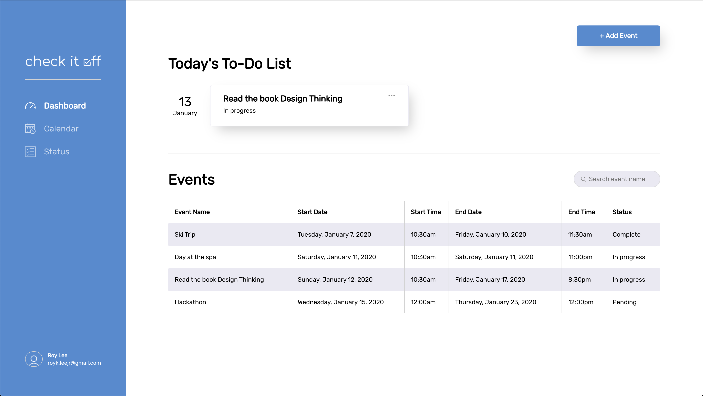
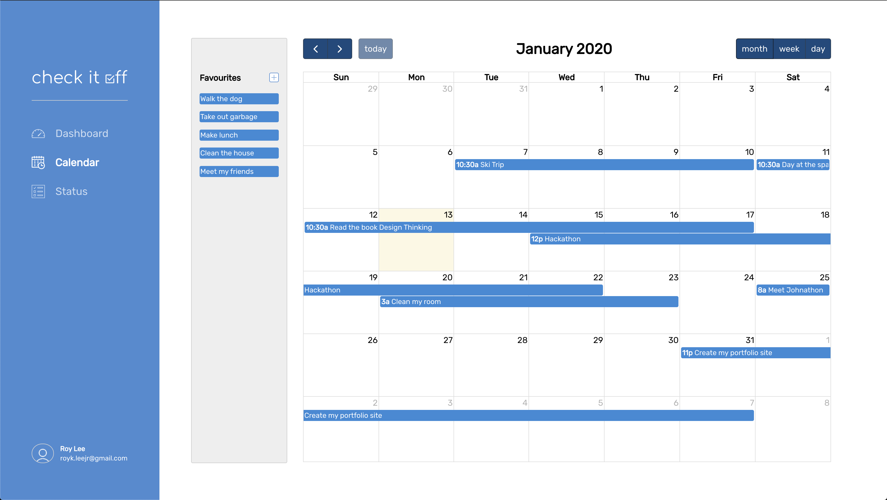
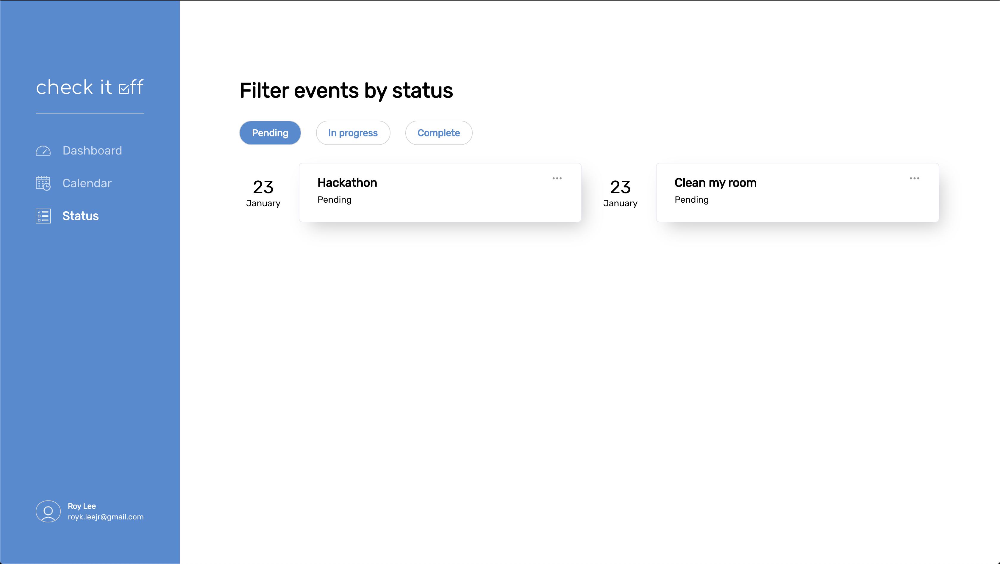

# Check It Off

## Due to time constraints, the site was built for the exact screen dimensions of 1680 x 950. Please view the site at these dimensions.

## Introduction

**CheckItOff** is a todo-list style application where you can easily keep track of everything you need to do with a dashboard page to see all your events, a drag and drop calendar page(using FullCalender)and a status page that filters events by status.

## Screenshots

Dashboard Page

Calendar Page

Status Page

## Technologies

- [React](https://reactjs.org)
- [SCSS](https://sass-lang.com/)
- [Javascript](https://www.javascript.com/)

## Features

##### Dashboard Page
- Dashboard page has an add event button that opens a modal that asks you to fill out information about the event and when you press save it adds that event with all the details to your todo-list.
- Under the button it shows today's to do list. Where all the events are filtered out except for the events that are going on today.
- Those event cards, if you press on the three dots drops down an edit and delete button. If you press on the edit button, opens up the same modal as the add event modal but has that events data already in the inputs where you can change just the values you want to change. For the delete button if you press that, it deletes the event from the event list.

##### Calendar Page
- Calendar page is used from [Full Calendar](https://FullCalendar.io).
- I wanted full reign over all the events so I decided to take control of the functionality of the events where I control the times, dates by accessing the a tags from the calendar.
- All the events are drag and droppable. 
- There are favourite events you use frequently where you can drag and drop easily and it will add to your event list.

##### Status Page
- Status page filters all the events by status. Either Pending, In Progress or Completed.
- These events also have a dropdown where you can either edit or delete the event.

### Ideas for Future Enhancements:

- I wanted to put all the events in a backend server with my own created API created from express. Where I can add, edit or delete each event in the backend but the requirements asked for either front-end or back end.
- I wanted to also add so many more features to the application but I didn't want to spend too much time making it for it was supposed to be completed in a shorter time frame. 

## Contact

Created by [Roy Lee](https://www.linkedin.com/in/roy-lee-jr/)